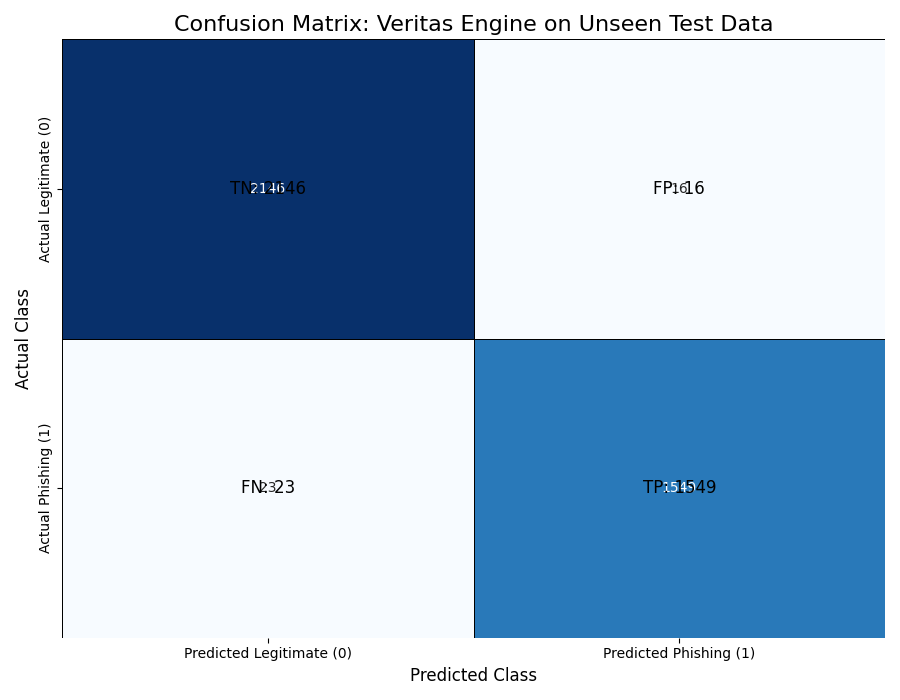
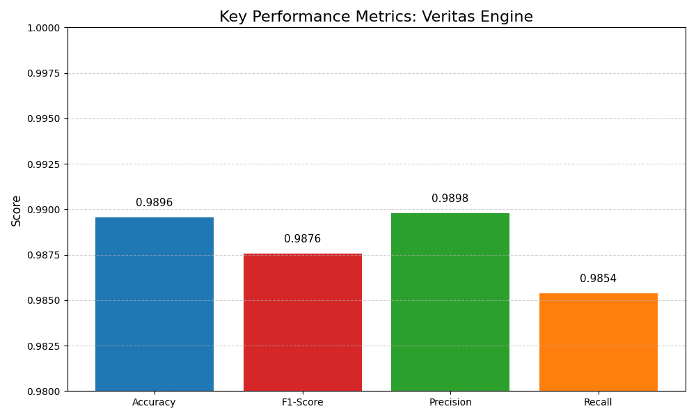

# Veritas Engine

Veritas Engine is an email classification system designed to identify **spam and phishing emails** using a transformer-based deep learning model. The project combines a trained DistilBERT-based classifier with a Flask web application to provide an interactive interface for email analysis.

> **Project Context:** Veritas Engine was developed as a collaborative group project. This repository is an independently maintained public publication of the project for documentation, development, and portfolio purposes.

---

## Overview

Email-based threats remain a common attack vector for organizations and individuals. Veritas Engine analyzes email content and classifies it into relevant categories to assist with identifying potentially malicious or unwanted messages.

The system consists of:

- A **DistilBERT-based text classification model**
- A **data preprocessing and training pipeline**
- A **Flask web application**
- A browser-based interface for submitting email content
- Evaluation artifacts including a confusion matrix and performance metrics
- A separately maintained private repository containing the raw training and validation datasets

The trained model is included with this repository, allowing the application to run without requiring access to the private datasets.

---

## Key Features

- Email text classification using a transformer-based model
- Spam and phishing detection
- Pre-trained model included for application inference
- Flask-based web interface
- Model training and evaluation notebook
- Confusion matrix visualization
- Performance metrics visualization
- CPU-compatible inference
- Separate private repository for raw training and validation datasets

---

## Architecture

```text
User Input
    |
    v
Flask Web Application
    |
    v
Text Preprocessing
    |
    v
Tokenization
    |
    v
DistilBERT Classifier
    |
    v
Classification Result
```

---

## Technology Stack

| Component | Technology |
|---|---|
| Programming Language | Python |
| Web Framework | Flask |
| Deep Learning | PyTorch |
| NLP / Transformer Framework | Hugging Face Transformers |
| Model | DistilBERT |
| Data Processing | Pandas, NumPy |
| Machine Learning | Scikit-learn |
| Text Processing | BeautifulSoup |
| Model Training | Hugging Face Trainer |
| Version Control | Git / Git LFS |

---

## Repository Structure

```text
Veritas-Engine/
|
+-- templates/
|
+-- veritas_engine_model/
|   +-- config.json
|   +-- model.safetensors
|   +-- special_tokens_map.json
|   +-- tokenizer.json
|   +-- tokenizer_config.json
|   +-- vocab.txt
|
+-- app.py
+-- model.ipynb
+-- confusion_matrix_heatmap.png
+-- performance_metrics_bar.png
+-- requirements.txt
+-- .gitignore
+-- .gitattributes
+-- README.md
```

---

## Dataset Access

The raw training and validation datasets are **not stored in this public repository**.

They are maintained separately in a private repository:

**Veritas-Engine-Data**

The private dataset repository contains:

```text
Veritas-Engine-Data/
|
+-- dataset/
    +-- Enron.csv
    +-- spam.csv
    +-- Phishing_validation_emails (1).csv
```

### Why is the Dataset Separate?

The raw datasets are maintained separately from the public application repository. This keeps the public repository focused on the application, trained model, source code, and documentation while allowing the raw training data to be managed independently.

The datasets are **not required to run the Veritas Engine application**, because the trained model is already included in this repository.

### Requesting Dataset Access

If you need the datasets to reproduce the model training process:

1. **Contact the project owner** through GitHub and request access to the private dataset repository.
2. After access has been provided, obtain the private repository URL.
3. Clone the private repository alongside the public `Veritas-Engine` repository.

For example:

```powershell
cd D:\GitHub
git clone <PRIVATE_DATA_REPOSITORY_URL> Veritas-Engine-Data
```

The recommended local directory structure is:

```text
D:\GitHub\
|
+-- Veritas-Engine\
|
+-- Veritas-Engine-Data\
    |
    +-- dataset\
        +-- Enron.csv
        +-- spam.csv
        +-- Phishing_validation_emails (1).csv
```

The training notebook is configured to look for the datasets at:

```text
../Veritas-Engine-Data/dataset
```

If the private dataset repository is stored somewhere else, set the following environment variable before running the training notebook:

```powershell
$env:VERITAS_DATA_PATH="C:\path\to\dataset"
```

> **Important:** Dataset access is separate from application access. You can clone, install, and run the public Veritas Engine application without access to the private dataset repository.

---

## Installation

### 1. Clone the Repository

```powershell
git clone https://github.com/kaivalya-kk/Veritas-Engine.git
cd Veritas-Engine
```

### 2. Create a Virtual Environment

```powershell
python -m venv venv
```

Activate it on Windows:

```powershell
.\venv\Scripts\Activate.ps1
```

### 3. Install Dependencies

```powershell
pip install -r requirements.txt
```

---

## Running the Application

Start the Flask application:

```powershell
python app.py
```

The application will start locally at:

```text
http://127.0.0.1:5000
```

Open the address in a web browser and submit email content for classification.

---

## Model Training

The model training workflow is documented in:

```text
model.ipynb
```

To reproduce the training process:

1. Obtain access to the private dataset repository.
2. Clone `Veritas-Engine-Data` alongside this repository.
3. Verify that the datasets are located under:

```text
Veritas-Engine-Data/dataset/
```

4. Set `VERITAS_DATA_PATH` if the datasets are stored elsewhere.
5. Open `model.ipynb`.
6. Execute the notebook cells to perform preprocessing, training, and evaluation.

The trained model is stored under:

```text
veritas_engine_model/
```

---

## Model Evaluation

The repository includes evaluation visualizations generated during model development.

### Confusion Matrix



### Performance Metrics



---

## Applications

Veritas Engine demonstrates the application of machine learning and natural language processing to cybersecurity use cases, including:

- Email threat classification
- Spam detection
- Phishing detection
- Transformer-based text classification
- Security-focused machine learning pipelines
- Web-based security analysis

---

## Security Considerations

Veritas Engine is intended for **educational, research, and demonstration purposes**.

Classification results should not be treated as definitive evidence that an email is malicious or safe. Automated classification systems can produce false positives and false negatives, and security decisions should incorporate additional analysis and appropriate security controls.

---

## Collaboration

Veritas Engine was developed collaboratively as a group project.

This repository is maintained under my GitHub account to provide a clean, documented, and reproducible public representation of the project.

---

## Author

**Kaivalya Khavane**

GitHub: [@kaivalya-kk](https://github.com/kaivalya-kk)

---

## License

License information will be added based on the applicable project and dataset terms.